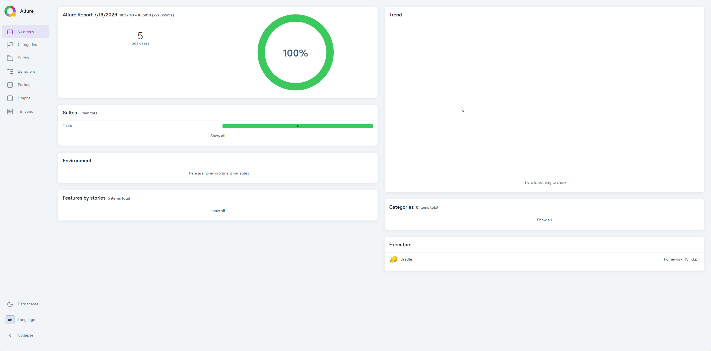
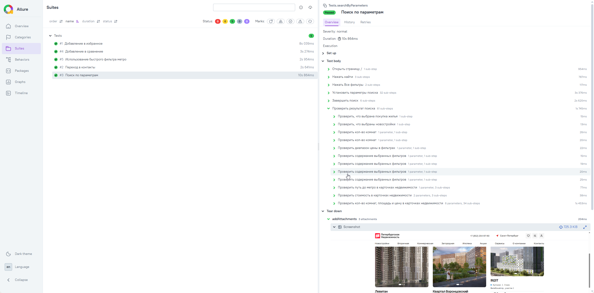
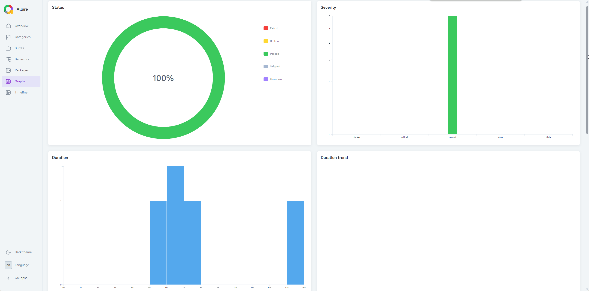

# Проект по автоматизации тестирования сайта компании [Петербургская недвижимость](https://new.pn.ru/)
> «Петербургская Недвижимость» — надёжный партнёр в покупке, продаже и аренде
## Содержание:

---
- [Технологии и инструменты](#технологии-и-инструменты)
---
## Технологии и инструменты

 

---
## Примеры автоматизированных тест-кейсов:

---
- ✓ *Поиск по параметрам*
- ✓ *Использование быстрого фильтра метро*
- ✓ *Добавление в избранное*
- ✓ *Переход в контакты*
- ✓ *Добавление в сравнение*
---
## Allure отчет

---
### *Основная страница отчета*

### *Тест-кейсы*

### *Графики*
